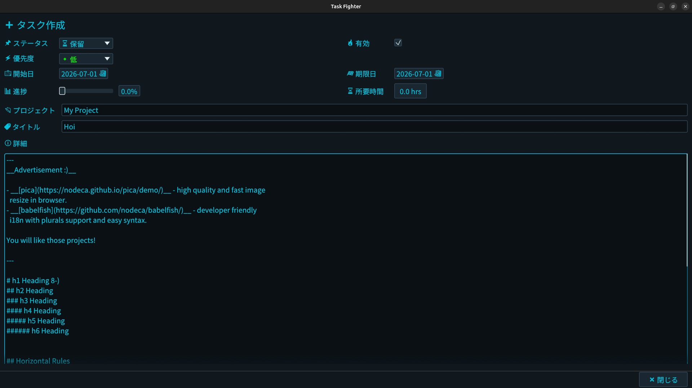
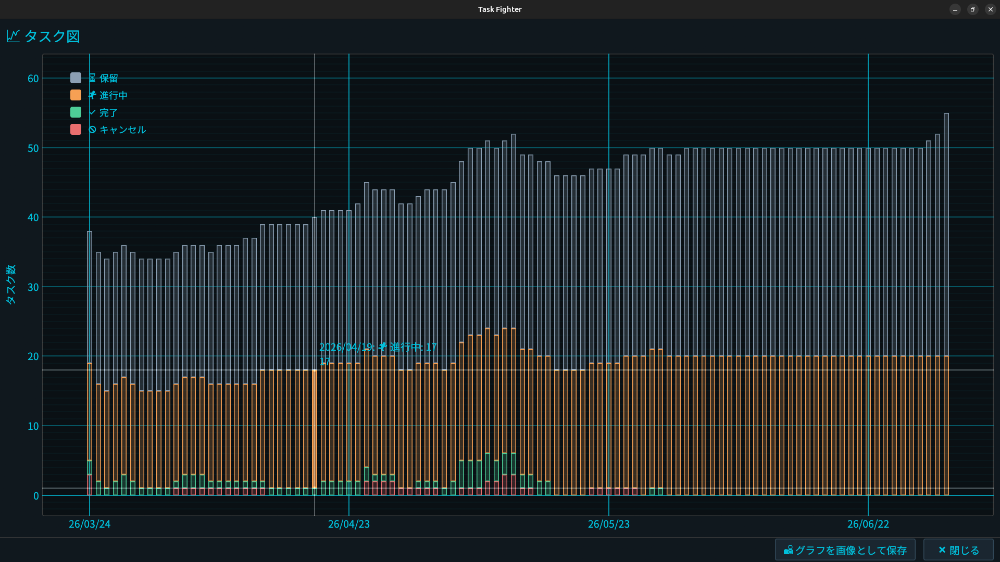
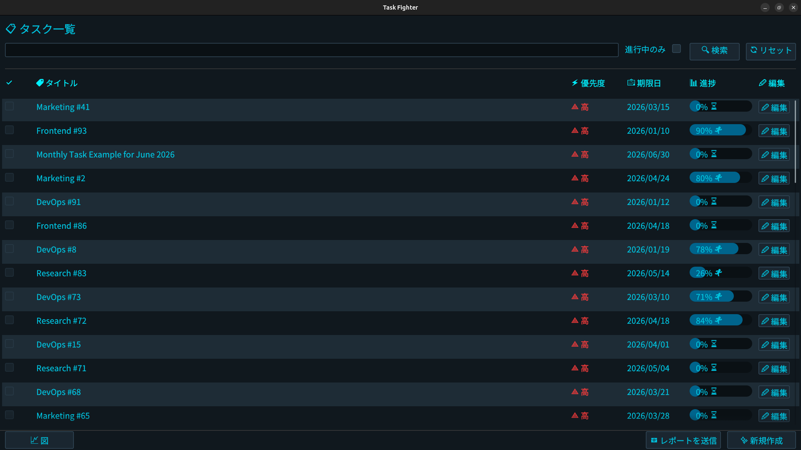

Task-Fighter
==========================================================================


Personal task management software with simple UI.

# Screen Shot




# Features
- **Simple & Intuitive UI**: Built with `egui` for a lightweight and responsive desktop experience.
- **Privacy First**: Completely local task management application.
- **High Performance**: Using [DuckDB](https://duckdb.org/) for fast, robust task recording and search.
- **Automated Task Creation**: Automatically schedules and generates your daily, weekly, and monthly tasks.
- **Automated Email Creation**: Dynamically generates emails based on your task status or summaries to streamline your workflow.

# Prerequisites
Make sure you have the Rust toolchain installed (Edition 2024 compliance required). If not, install it from [rustup.rs](https://rustup.rs).

# How to build
Clone this repository and execute the command below.

```bash
git clone https://github.com
cd task-fighter
cargo build --release
```

To run the application immediately, use:

```bash
cargo run --release
```

# License
This project is licensed under the Apache License, Version 2.0. See [LICENSE](./LICENSE) for details.

## Third-Party Licenses
This software bundles or links the following third-party components:

- **Noto Sans JP**
  - Licensed under the SIL Open Font License, Version 1.1.
  - Copyright 2015 Google Inc. All Rights Reserved.
  - For more details, see the [SIL Open Font License](https://openfontlicense.org).
- **DuckDB**
  - Licensed under the MIT License.
  - Copyright 2018-2026 DuckDB Foundation.
  - For more details, see the [DuckDB Website](https://duckdb.org).
- **egui / eframe**
  - Dual-licensed under the MIT License OR Apache License, Version 2.0.
  - Copyright (c) 2020 Emil Ernerfeldt.
  - For more details, see the [egui GitHub Repository](https://github.com).
