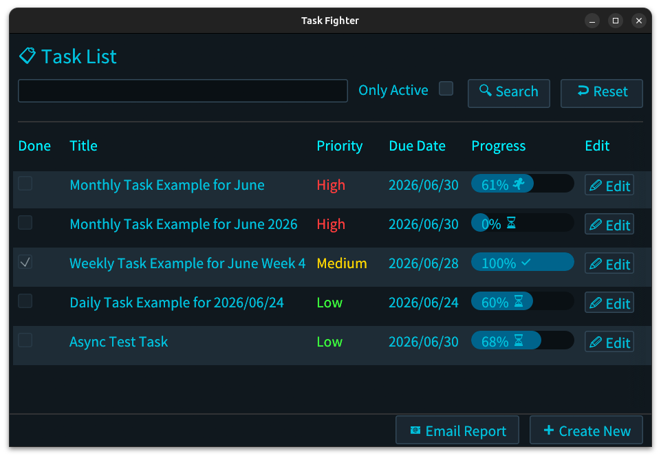
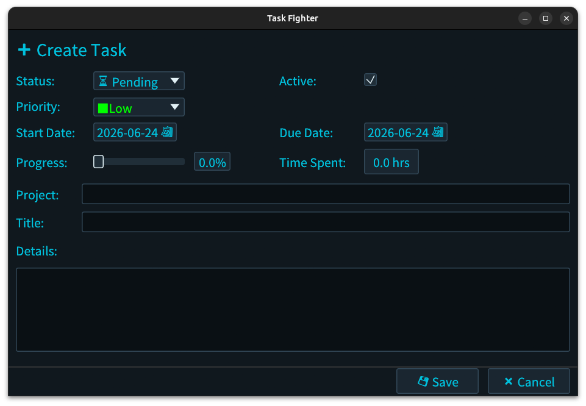

Task-Fighter
==========================================================================


Private task management software with simple UI.

# Screen Shot



# Features
- **Simple & Intuitive UI**: Built with `egui` for a lightweight and responsive desktop experience.
- **Privacy First**: Completely local task management application.
- **High Performance**: Using [DuckDB](https://duckdb.org/) for fast, robust task recording and search.
- **Automated Task Creation**: Automatically schedules and generates your daily, weekly, and monthly tasks.
- **Automated Email Creation**: Dynamically generates emails based on your task status or summaries to streamline your workflow.

# Prerequisites
Make sure you have the Rust toolchain installed (Edition 2024 compliance required). If not, install it from [rustup.rs](https://rustup.rs).

# How to build
Clone this repository and execute the command below.

```bash
git clone https://github.com
cd task-fighter
cargo build --release
```

To run the application immediately, use:

```bash
cargo run --release
```

# License
This project is licensed under the Apache License, Version 2.0. See [LICENSE](./LICENSE) for details.
